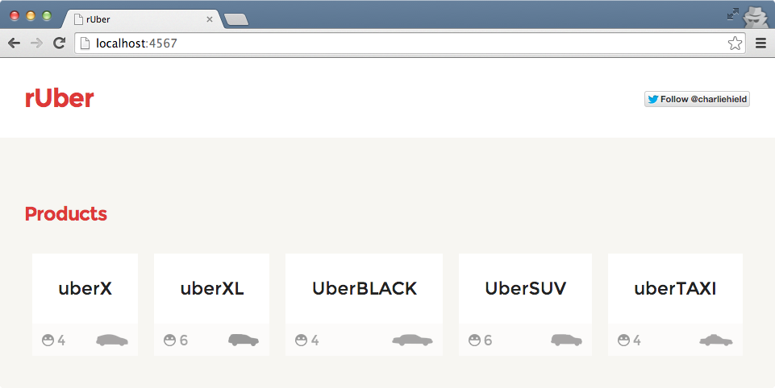

rUber
=====

Example app using [Uber’s API](https://www.uber.com/) with Ruby. This demo app simple shows available products based on location. Uber also has more [endpoints here](https://developer.uber.com/v1/endpoints/).



Getting started
---------------

Clone the repo.

```bash
$ git clone https://github.com/stursby/ruber.git
```

Install packages. Make sure you have [Bundler](http://bundler.io/) installed first. `gem install bundler`

```bash
$ bundle install
```

Register your App with Uber
---------------------------

Visit the [Uber API Registration page](https://login.uber.com/applications/new) and sign up. Once you have an app created, set your Server Token as an environment variable.

```bash
export SERVER_TOKEN='mytokenhere'
```

Run the App!
------------

Run the following, and you should have a working app on `http://localhost:4567/`.

```bash
ruby app.rb
```